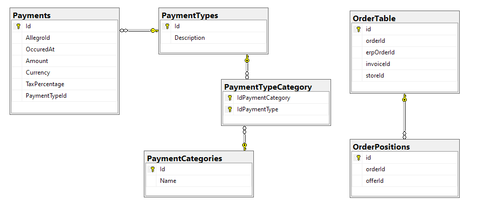

# cost collector

Aplikacja pobiera koszty zamowień z allegro api oraz
1. Zapisuje nowe pozycje do bazy
2. Jednocześnie wypisuje na konsoli pozycje z kategorii "koszty stałe"

## Zrobione

* Utworzone zadane w zadaniu encje z przykładowymi danymi
* Encje do zapisu
  * Płatności
  * Typy płatności - *type* z allego api (migracje zawierają niektóre typy)
  * Kategorie płatności - koszty stałe, prowizje, inne koszty
* Pobieranie access tokena z dysku lub appsettings.json lub user-secrets
  * Klasa *TokenReader* ma zmienną *path*. Stamdtąd nastąpi próba pobrania ściągniętego tokena
* Modele danych z allegro api dla płatności powiązanych z zamówieniem i takich, które nie odnoszą się do zamówinia (np. wpłata)
* Pobieranie danych z allegro api
* Serwisy
  * *AllegroClient* - w warstwie *Infrastructure*  pobiera koszty z api
    * wszystkie
    * albo tylko powiązane z zamówieniem (parametr opcjonalny)
  * Jest też *AllegroService* w warstwie aplikacyjnej utylizujące *AllegroClient*.  
  * *PaymentParser* - parsuje różne typy płatności. Wykorzystywany przez *AllegroClient*
  * Customowe konwertery deserializatora json zwracają sparsowane dane w odpowiednich typach (kwota do decimal itd.)
  * Pobieranie kategorii kosztów z appsettings
    * wskazuje jakie typy są kosztami stałymi, a jakie kosztami transakcji
  * Repozytorium *PaymentRepository* (MS SQL) w warstwie *Infrastructure*
  * *PaymentService* wykorzystuje powyższe repozytorium
    * Zapis danych pobranych z allegro
    * Wyświetlenie pozycji z kategorii "koszty stałe"
* Aplikacja zapisuje wynik działania do tabeli `[militaria].[dbo].[Payments]`
  * Pobierane są tylko płatności związane z istniejącym w bazie zamówieniem 
  * Nie są zapisywane duplikaty płatności przy ponownym uruchomieniu aplikacji
* Mapery modeli danych z allegro do encji bazodanowych

## Nie przewidziane
1. Testy (na życzenie ;)
2. Obsługa błędów. Polityki obsługi transient I/O errors. Szczególnie błędów warstwy persystencji i nieważnego tokena
   1. Wykonując koncepcję, jak tu chodzi raczej o pokazanie struktury aplikacji niż o wdrożenie wersji z pełną obsługą błędów. W niektórych przypadkach w warstwie aplikacji zaznaczyłem bloki try/catch 

## Demo

1. Ustaw miejsce z którego będzie pobierany access token (user-secrets/appsettings.json lub folder *Download* Twojego komputera)
2. Ustaw connection string do bazy *militaria*
3. Zaaplikuj migracje *dotnet ef database update*
4. Pobierz token
5. Uruchom aplikację
6. Aplikacja zapisze do bazy pobrane platności
7. Aplikacja wypisze na konsoli "koszty stałe" zapisane w bazie

## Diagram encji

Schematy encji po prawej (OrderTable i OrderPositions) były dane w postaci skryptów SQL.

